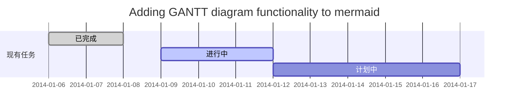
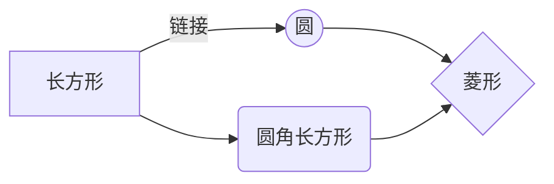

### 标题
```md
# 一级标题
## 二级标题
### 三级标题
#### 四级标题
##### 五级标题
###### 六级标题
```
### 强调
```md
*这是斜体示例*
_这是斜体的另一种写法_
```
*这是斜体示例*
_这是斜体的另一种写法_
```md
**这是粗体示例**
__这是粗体的另一种写法__
```
**这是粗体示例**
__这是粗体的另一种写法__
```md
_你也**可以**将它们配合使用_
```
_你也**可以**将它们配合使用_
### 列表

```md
- 项目 1
- 项目 2
	- 项目 2a
	- 项目 2b

1. 项目 1
1. 项目 2
1. 项目 3
   1. 项目 3a
   1. 项目 3b
```

无序列表：
- 项目 1
- 项目 2
	- 项目 2a
	- 项目 2b

有序列表：
1. 项目 1
1. 项目 2
1. 项目 3
	1. 项目 3a
	2. 项目 3b
### 链接
#### Wiki 链接
```md
链接一篇笔记：[[内部链接]]。
```
##### 语法
```md
[[内部链接#title]] 链接到标题
[[内部链接^title]] 链接到文本
[[内部链接|title]] 显示文本
```
#### 嵌入文件(实时显示)
在笔记中插入并实时显示
```md
![[Obsidian#什么是 Obsidian]]
```
#### 外部链接

Markdown 风格的链接既可以用来指向网页这类外部对象，也可以用来指向库中的笔记或者图片。

```md
http://obsidian.md - automatic!
[Obsidian](http://obsidian.md)
```
[Obsidian](http://obsidian.md)
#### 图片
```md

```
##### 调整图片大小
比如，将上面的示例图片调整为100像素宽：

```md

```
### 行内代码

```md
一行中被 `反引号` 括起来的文字会以代码格式显示。
```

一行中被`反引号`括起来的文字会以代码格式显示。

### 代码块

Obsidian 会将六个反引号括起来的内容识别为代码块，并将其按代码格式显示。代码块支持语法高亮功能，你可以在代码块的第一行（即开头处的反引号后）声明语言来使用特定的语法高亮。

代码块的语法高亮实际是使用`prismjs`来实现的，因此你可以到[他们的网站](https://prismjs.com/#supported-languages) 来查看其支持的语言。

<pre><code>```js
function fancyAlert(arg) {
  if(arg) {
    $.facebox({div:'#foo'})
  }
}
```</code></pre>

```js
function fancyAlert(arg) {
  if(arg) {
    $.facebox({div:'#foo'})
  }
}
```

### 任务列表

```md
- [x] 支持 #标签 ，[链接]()，**样式**
- [x] 要求包含列表标志（有序表无序表均可，比如 `1.[x]` 同样可以）
- [x] 这是一个已经完成的项目
- [ ] 这是一个未完成的项目
- [ ] 在预览模式下单击选框可以切换项目完成状态
```

- [x] 支持 #标签 ，[链接]()，**样式**
- [ ] 要求包含列表标志（有序表无序表均可，比如 `1.[x]` 同样可以）
- [x] 这是一个已经完成的项目
- [ ] 这是一个未完成的项目 
- [ ] 在预览模式下单击选框可以切换项目完成状态

### 表格

你可以使用 `-` 来分割表格的标题行和内容行，使用 `|` 来指定不同的列：

```md
| 标题1          | 标题2          |
| -------------- | -------------- |
| 单元格11的内容 | 单元格12的内容 |
| 单元格21的内容 | 单元格22的内容 |
```

| 标题1          | 标题2          |
| -------------- | -------------- |
| 单元格11的内容 | 单元格12的内容 |
| 单元格21的内容 | 单元格22的内容 |

---

| 列宽可以通过冒号来进行调整 | 这样你就可以在标题行中输入长标题 |
| :------------------------- | -------------------------------: |
| 因为 `:` 的存在            |             不同列将有不同的列宽 |

你可以在表格中添加链接，因为链接能在表格中正确显示。但如果你的链接中包含 `|`，则需要对其进行转义（用 `\|` 代替 `|`），以防止链接中的竖线被错误识别为列分隔符。

如果你在列表中添加链接，他们可以正常的显示与使用。但如果使用的是竖线链接，则需要在竖线前面加上 `\` 来进行转义，防止表格错乱。

```md
| 标题1                      | 标题2              |
| -------------------------- | ------------------ |
| [[格式化你的笔记\|格式化]] | [[快捷键\|快捷键]] |
```

| 标题1                      | 标题2              |
| -------------------------- | ------------------ |
| [[格式化你的笔记\|格式化]] | [[快捷键\|快捷键]] |

### 删除线

```md
在文字两端加上波浪线将会显示为删除效果，比如~~这样~~。
```

在文字两端加上波浪线将会显示为删除效果，比如~~这样~~。

---

###  高亮

```md
使用两个等号来对文本进行高亮==文本==。
```

使用两个等号来对文本进行高亮==文本==。

---

### 脚注
脚注的用法很简单，只需要在段落中需要插入脚注的地方标注一个符号，再在段落后对这个符号进行解释即可。
```md
比如这是一个简单的脚注，[^1] 这是一个长一些的脚注。[^长脚注]

[^1]: 很有用！
[^长脚注]: 这是一个可以写长段落或者代码的地方。
	
	你可以使用缩进在脚注中纳入其他段落。
	
	`{ 代码 }`

	这样你就可以在脚注中添加任意数量的段落了。
```

比如这是一个简单的脚注，[^1] 这是一个长一些的脚注。[^长脚注]

[^1]: 很有用！
[^长脚注]: 这是一个可以写长段落或者代码的地方。
	你可以使用缩进在脚注中纳入其他段落。
	`{ 代码 }`
	这样你就可以在脚注中添加任意数量的段落了。
	结束必须空一行。

你也可以使用行内脚注。^[请注意符号^需要在方括号外]

### 显示按键操作

```markdown
<kbd>ctrl+z</kbd>
```

<kbd>ctrl+z</kbd>

### 扩展
mermaid.js


